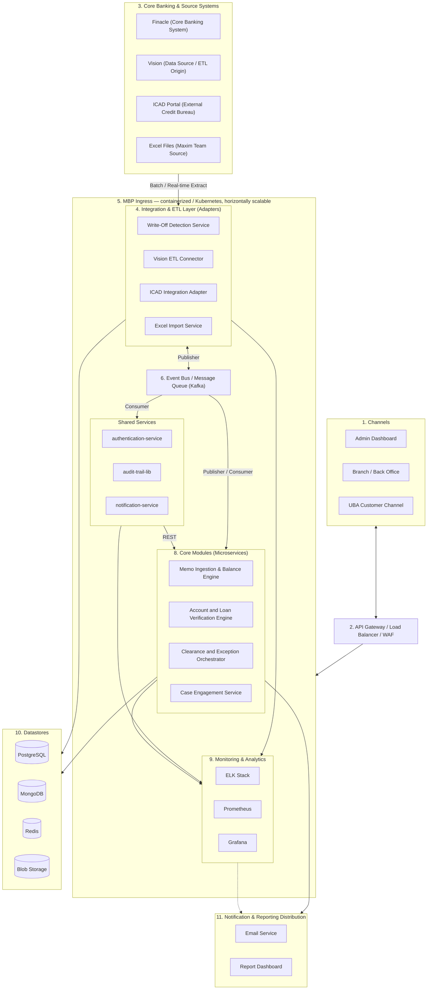

# MBP Component Diagram (as proposed by Heirs Technologies)

> Primary source. Redrawn from the PNG the user supplied ("HEIRS TECHNOLOGIES — Memo Balance Portal (MBP) - End-to-End Solution Architecture // Component Design") as Mermaid + a component inventory, so it's text-diffable and readable by future agent sessions. Numbers below match the numbered callouts on the original diagram.

## Diagram

## Component inventory

| # | Layer | Components | Notes |
|---|---|---|---|
| 1 | Channels | Admin Dashboard, Branch/Back Office, UBA Customer Channel | Consuming front ends; talk to the platform only through the gateway |
| 2 | Perimeter | API Gateway / Load Balancer / WAF | Single ingress; see [ADR-0004](../adr/0004-api-gateway-waf-perimeter.md) |
| 3 | External systems | Finacle (core banking), Vision (ETL origin), ICAD Portal (external credit bureau), Excel files (Maxim team) | Owned outside MBP; MBP only integrates against them |
| 4 | Integration & ETL adapters | Write-Off Detection Service, Vision ETL Connector, ICAD Integration Adapter, Excel Import Service | Anti-corruption layer — see `integration` context in [CONTEXT-MAP.md](../../CONTEXT-MAP.md) |
| 5 | Platform | MBP Ingress — containerized, Kubernetes, horizontally scalable | See [ADR-0002](../adr/0002-containerized-microservices-on-kubernetes.md) |
| 6 | Backbone | Event Bus / Message Queue (Kafka) | See [ADR-0001](../adr/0001-event-driven-integration-via-kafka.md) |
| 7 | Shared services | authentication-service, audit-trail-lib, notification-service | `authentication-service` + `notification-service` are the `shared-platform` context; `audit-trail-lib` is a cross-cutting logging contract, not a bounded context — see the architect's note in [CONTEXT-MAP.md](../../CONTEXT-MAP.md) |
| 8 | Core modules | Memo Ingestion & Balance Engine, Account and Loan Verification Engine, Clearance and Exception Orchestrator, Case Engagement Service | Mapped onto contexts `memo-balance`, `account-verification`, `clearance-orchestration` (narrowed), `case-engagement` |
| 9 | Observability | ELK Stack, Prometheus, Grafana | See [ADR-0005](../adr/0005-centralized-observability.md) |
| 10 | Datastores | PostgreSQL, MongoDB, Redis, Blob Storage | See [ADR-0003](../adr/0003-polyglot-persistence.md) |
| 11 | Distribution | Email Service, Report Dashboard | Part of the `reporting` context — scoped per RFP §3.15, not just this thin distribution layer |

## Architect's deltas from this diagram

See "Architect's take on the proposed diagram" in the setup plan for the full reasoning. Summary of what changed going from diagram → bounded contexts:

1. **Clearance and Exception Orchestrator** narrowed to ICAD clearance only; balance/payment exception handling folded into `memo-balance` instead.
2. **audit-trail-lib** is not a bounded context — it's a shared logging contract every service depends on, documented once at the system level.
3. **RFP §3.14 (Country & Configuration)** has no box on this diagram; given its own thin context, `reference-data-config`.
4. **Reporting** is scoped to the full RFP §3.15 subsystem (scheduled jobs, GL reconciliation, retention, lineage), not just the "Email Service + Report Dashboard" shown here.
